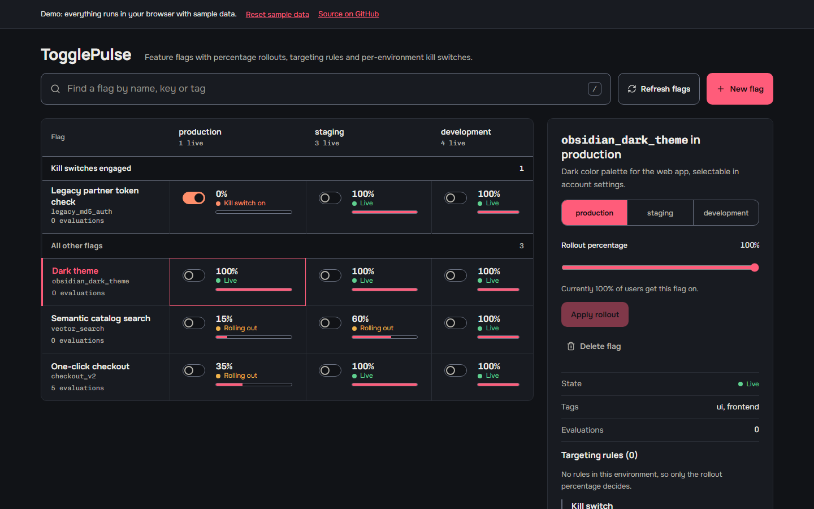

# TogglePulse

TogglePulse is a feature flag service. Teams use it to turn features on for a percentage of users, target specific groups with rules, and switch a feature off in one environment with a kill switch, without redeploying. It has an Express API with SQLite storage and a React console for managing flags and testing what a user would get.

[](https://github.com/Taan1el/togglepulse/actions/workflows/ci.yml)
[](https://github.com/Taan1el/togglepulse/actions/workflows/pages.yml)
[](LICENSE)

**Live demo:** https://taan1el.github.io/togglepulse/

The demo runs entirely in your browser. The same evaluation and validation code the server uses runs against a fixed set of sample flags held in memory, so it needs no backend. Reloading the page or choosing "Reset sample data" returns to the starting data.

## Screenshots



More screenshots: [flag settings with rules and the kill switch](docs/screenshots/02-flag-settings.png), [the evaluation tester with a result](docs/screenshots/03-evaluation-tester.png), [the console at phone width, with each flag stacked over its three environments](docs/screenshots/04-mobile.png).

## Features

- **Percentage rollouts** per environment (`production`, `staging`, `development`). A user's bucket is a number from 0 to 99 derived from a SHA-256 hash, and the flag is on when the bucket is below the rollout percentage.
- **Targeting rules** with the operators `EQUALS`, `NOT_EQUALS`, `IN`, `NOT_IN`, `CONTAINS`, `STARTS_WITH` and `SEMVER_GTE`. Rules are checked in order and the first match decides.
- **Kill switch** per flag and environment. It forces the flag off and keeps the stored rollout and rules, so releasing it resumes the previous configuration.
- **Evaluation endpoint** that returns the result, the reason and the bucket, and records each evaluation in an audit table with per-flag counters.
- **Console** on a dark ground: a command bar to filter flags, a toggle matrix with one row per flag and one column per environment (kill switch toggle, rollout percentage and state in every cell), a pinned group for flags with an engaged kill switch, and a right-side drawer with the rollout slider, the read-only rules table, the kill switch and the evaluation tester.
- **GitHub Pages demo** with deterministic sample data.

## Getting started

### Prerequisites
- Node.js 22.5 or newer (`node:sqlite` needs 22.5+). CI runs on Node 22 and 24.
- npm 10 or newer

### Install
```bash
git clone https://github.com/Taan1el/togglepulse.git
cd togglepulse
npm install
```

### Run
```bash
npm run dev
```
This starts the API on port 4000 and the Vite dev server on port 5173. Open **http://localhost:5173**. On first start the server creates `data/togglepulse.db` in its working directory and seeds four sample flags.

### Environment variables
No variable is required for the defaults above.

| Variable | Used by | Default | Purpose |
|---|---|---|---|
| `PORT` | server | `4000` | Port the Express server listens on. See `server/.env.example`. |
| `VITE_API_TARGET` | client, dev only | `http://localhost:4000` | Where the Vite dev server proxies `/api` when the server uses another port. See `client/.env.example`. |

`VITE_DEMO_MODE` is set by `npm run build:pages` itself and should not be set by hand.

### Scripts

| Script | What it does |
|---|---|
| `npm run dev` | Server (tsx watch) and client (Vite) together |
| `npm run lint` | Type-check server and client (`tsc --noEmit`) |
| `npm test` | Server and client test suites |
| `npm run build` | Compile the server to `server/dist` and bundle the client to `client/dist` |
| `npm run build:pages` | Bundle the client in demo mode with the `/togglepulse/` base path |
| `npm start --workspace=server` | Run the compiled server (after `npm run build`) |

## How it works

### Evaluation order

For one flag, one environment and one user context, the first rule that applies decides:

1. No configuration for that environment name: off (`DEFAULT_OFF`).
2. Kill switch on: off (`KILL_SWITCH`).
3. Environment disabled: off (`DISABLED`).
4. Targeting rules, in order: the first match returns that rule's `serveValue` (`RULE_MATCH`).
5. Percentage rollout: on when `bucket < rolloutPercentage` (`ROLLOUT_BUCKET`).

Rule comparisons are case-insensitive. `userId` can be used as a rule attribute; other attributes come from the request's `attributes` object. A missing attribute never matches, including for `NOT_EQUALS` and `NOT_IN`.

### Bucketing and stickiness

```
bucket = first 4 bytes of SHA-256("<userId>:<flagKey>") read as a big-endian unsigned integer, modulo 100
```

- The result depends only on the user ID and the flag key. It does not depend on the rollout percentage, on the server, or on any stored assignment, so the same user gets the same bucket on every evaluation and every node.
- Raising a percentage from 10 to 25 keeps everyone who was in at 10 and adds more users; lowering it removes users from the top down. This holds as long as the flag key and the rules do not change. A matching rule, a kill switch or a disabled environment takes priority over the bucket.
- Different flag keys hash differently, so being early in one rollout says nothing about another.
- Buckets are close to evenly spread, but with a small number of users the enabled share can differ noticeably from the percentage.
- No assignment is stored. Each evaluation does record an audit row and increments the flag's counter.

### Project layout

```
shared/    Types, evaluation logic, a synchronous SHA-256, validation and sample data.
           Used by the server and by the browser demo.
server/    Express app: routes, controller, FlagService, repository, SQLite schema and seed
client/    React 19 + Vite console, demo data layer (src/services/demoApi.ts), tests
docs/      Architecture decision records and screenshots
```

The client imports its data functions from `client/src/services/index.ts`, which uses the real API normally and the in-browser adapter in the Pages build.

## API reference

Base path `/api`. Responses are `{ "success": true, "data": ... }` or `{ "success": false, "code": "...", "error": "..." }`.

| Method | Endpoint | Description |
|---|---|---|
| `GET` | `/api/health` | Service health check |
| `GET` | `/api/flags` | List flags, newest update first |
| `POST` | `/api/flags` | Create a flag |
| `GET` | `/api/flags/:key` | Get one flag with its environments and rules |
| `PATCH` | `/api/flags/:key/rollout` | Update `rolloutPercentage`, `enabled` or `killSwitchActive` for an `environment` |
| `POST` | `/api/flags/:key/killswitch` | Body `{ "environment": "production", "active": true }` |
| `POST` | `/api/flags/:key/evaluate` | Body `{ "environment": "production", "context": { "userId": "u1", "attributes": { "country": "EE" } } }` |
| `DELETE` | `/api/flags/:key` | Delete a flag and its audit rows |
| `GET` | `/api/flags/:key/stats` | Counts of evaluations, true results and kill switch results |
| `GET` | `/api/audits` | Recent evaluations, optionally `?flagKey=` and `?limit=` (default 50, at most 500) |

### Creating a flag

`key` and `name` are required. The key is trimmed, lowercased, and every character other than letters, digits, `_` and `-` becomes `_`. `tags` must be an array. `environments` may contain `production`, `staging` and `development` objects with `enabled`, `killSwitchActive` (booleans), `rolloutPercentage` (a finite number from 0 to 100, fractions allowed) and `rules`. Each rule needs a unique string `id`, an `attribute`, an `operator` from the list above, an array of string `values` and a boolean `serveValue`. Omitted fields default to enabled, kill switch off, no rules, and 0% in production and 100% in staging and development. The rollout endpoint clamps percentages to 0 to 100 instead of rejecting them, and only accepts the three environment names.

Rules can only be set when a flag is created. There is no endpoint or console control for editing them afterwards.

### Errors

| HTTP status | Code | Meaning |
|---|---|---|
| 400 | `VALIDATION_ERROR` | The request failed validation |
| 400 | `INVALID_JSON` | The body is not valid JSON |
| 404 | `NOT_FOUND` | The flag or the route does not exist |
| 500 | `INTERNAL_ERROR` | Unexpected failure; the message is generic and details stay in the server log |

## Testing

```bash
npm test
```

- Server (Vitest and supertest, in-memory SQLite): routes, validation, error contract, rule operators, evaluation precedence, kill switch behavior, bucketing against `node:crypto`, and the rollout superset property.
- Client (Vitest and Testing Library): the console flows (matrix, environment cells, filter, rollout, kill switch, tester, create and delete) against a mocked `fetch`, the demo data layer, the demo bar, and the count helper.
- Accessibility: the client suite also runs automated axe checks (WCAG 2 A and AA rules) on the flag matrix, the detail drawer and the new flag dialog. jsdom cannot compute colors, so color contrast is checked outside the test suite.

No test waits on real timers.

## Deployment

### Docker

```bash
docker compose up --build
```

The image builds the server and the client, runs as the unprivileged `node` user, and serves the built client and the API on **http://localhost:4000**. The compose file keeps the SQLite database in the `togglepulse-data` volume mounted at `/app/data`.

### GitHub Pages

`.github/workflows/pages.yml` builds `npm run build:pages` on every push to `main` and uploads `client/dist`. The deploy job is skipped while the repository is private and publishes to `https://taan1el.github.io/togglepulse/` once it is public.

## Design notes and limitations

- The interface follows a utilitarian layout: one crimson accent, flat meters with the value printed next to them, status shown as a dot plus text, and no gradients or animation.
- There is no authentication. Anyone who can reach the API can change flags, so run it behind your own access control.
- It is a single-node service backed by one SQLite file. Running several instances would need a shared database.
- Every evaluation writes an audit row and the table is never pruned.
- Configuration changes (rollout, kill switch, create, delete) are not recorded in the audit trail; only evaluations are.
- Clients are not notified of changes. Each evaluation reads the current stored configuration.
- Evaluation latency has not been measured, so no figure is claimed.
- The demo keeps its data in memory only.

## Roadmap

- Edit targeting rules in the API and the console.
- API keys for write requests.
- Record configuration changes in the audit trail and prune old audit rows.
- Client libraries for evaluating flags from application code.

## License

MIT. See [LICENSE](LICENSE).
