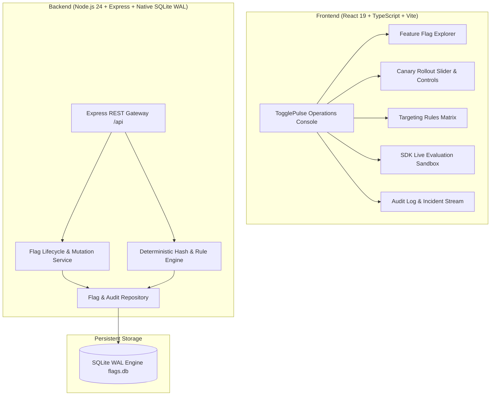

# TogglePulse 🚦⚡
> **Multi-Tenant Feature Flagging, Percentage-Based Canary Rollouts & Dynamic Configuration Engine**  
> *Engineered for High-Throughput Microsecond Evaluation (<1ms), Deterministic Hash Bucketing & Zero-Downtime Safe Deployments*

[](#)
[](#)
[](#)
[-003B57.svg?style=flat-square)](#)
[](#)
[](#)
[](#)

---

## ⚡ Overview
**TogglePulse** is an enterprise-grade feature flagging and canary deployment platform inspired by LaunchDarkly, Unleash, and modern cloud-native deployment orchestrators. Built for high-concurrency microservices, it provides deterministic percentage rollouts, user targeting rules (semver, geographic/tier attributes, set inclusion), emergency kill switches with microsecond precedence, and an interactive SDK evaluation playground.

### Core Capabilities
1. **Deterministic SHA-256 Hash Bucketing (0-99)**: Users with the same identifier and flag key consistently land in the exact same rollout bucket across any number of stateless backend nodes without sticky sessions or centralized Redis locks.
2. **Multi-Strategy Targeting Rule Hierarchy**: Evaluates targeted user IDs first, followed by custom attribute predicates (equals, not_equals, contains, in, not_in, greater_than, less_than, semver_gte), before falling back to canary rollout percentages and default values.
3. **Sub-Millisecond Emergency Kill Switch**: When an incident occurs, flags can be killed with zero latency. The kill switch instantly overrides all rollout percentages and targeting rules, reverting affected services to safe default states within <1ms.
4. **Interactive SDK Evaluation Sandbox**: Test evaluation outcomes live against arbitrary user contexts, simulating production canary buckets, rule matches, and reason codes (TARGET_MATCH, RULE_MATCH, PERCENTAGE_ROLLOUT, DISABLED, KILLED).
5. **Real-time Evaluation Telemetry & Audit Trail**: Records every flag toggle, percentage change, and rule mutation with comprehensive audit logs and evaluation counters.
6. **Zero External Runtime Dependencies**: Built with Node.js 24 native SQLite (DatabaseSync in WAL mode) and native node:crypto, delivering instantaneous local setup with zero Docker prerequisite.

---

## 🏛️ System Architecture



---

## 🚀 Deterministic Bucketing Algorithm

To guarantee consistent user allocation without cross-process locking or stateful storage, TogglePulse uses cryptographic hash bucketing:

```
Bucket(user_id, flag_key) = (SHA256(flag_key + ":" + user_id)[0..4]) % 100
```

- **Stability**: A user assigned to the 10% canary tier will remain enabled as the canary expands to 25% or 50%.
- **Independence**: Flag keys are salt-combined, ensuring user distribution is decorrelated across different feature flags.
- **Zero Drift**: Stateless nodes produce bit-for-bit identical results in <0.1ms.

---

## 🛠️ Tech Stack & Engineering Standards

| Layer | Technology | Rationale |
|---|---|---|
| **Runtime** | Node.js 24 (ES Modules) | High-performance asynchronous runtime with native crypto & SQLite |
| **Language** | TypeScript 5.8 (Strict Mode) | Full-stack end-to-end type safety between backend and frontend |
| **Backend Framework** | Express 4.21 | Clean REST architecture with standard middleware and error boundaries |
| **Database** | Native SQLite (`DatabaseSync`) | Zero-config relational persistence with Write-Ahead Logging (WAL) |
| **Frontend** | React 19 + Vite 6 | Modern component hierarchy with fast HMR and optimized bundle output |
| **Styling** | Modern CSS Variables & Design Tokens | Dark-mode terminal-inspired theme with responsive mobile/desktop layouts |
| **Testing** | Vitest 3.0 + React Testing Library | Fast unit and integration tests across evaluation logic and UI |
| **Containerization** | Docker Multi-Stage + Compose | Production alpine container with unprivileged non-root runner |
| **Architecture** | ADRs (`docs/adr/`) | Recorded decisions on determinism, SQLite WAL, and rule precedence |

---

## 🔌 REST API Reference

| Method | Endpoint | Description |
|---|---|---|
| `GET` | `/api/health` | Service health check |
| `GET` | `/api/flags` | List all feature flags with targeting rules |
| `POST` | `/api/flags` | Create a new feature flag with initial rollout config |
| `GET` | `/api/flags/:key` | Get flag details, rules, and environment configuration |
| `PATCH` | `/api/flags/:key/rollout` | Update rollout percentage, enabled state, or kill switch for an environment |
| `POST` | `/api/flags/:key/killswitch` | Toggle the emergency kill switch (instant override) for an environment |
| `POST` | `/api/flags/:key/evaluate` | Evaluate a single flag for a user context |
| `DELETE` | `/api/flags/:key` | Delete a feature flag |
| `GET` | `/api/flags/:key/stats` | Evaluation counters for a flag (true/false/kill-switch totals) |
| `GET` | `/api/audits` | Chronological audit trail of flag mutations and evaluations, optionally filtered by `flagKey` |

### Error responses

When creating a flag, `environments` and any supplied `production`, `staging`, or
`development` configuration must be objects. Supplied `enabled` and
`killSwitchActive` values must be JSON booleans. Initial `rolloutPercentage` values
must be finite numbers from 0 through 100 (fractions are supported). Invalid values
return `400 VALIDATION_ERROR` without creating a flag. Omitted fields keep their
defaults: enabled, kill switch inactive, no rules, and 0% production / 100% staging
and development rollout. Creation rejects out-of-range percentages; the rollout
update endpoint continues to clamp numeric percentages to this range.

Every error response contains a stable `code` and a readable `error` string; clients
should branch on `code` rather than message text.

| HTTP status | Code | Meaning |
| --- | --- | --- |
| 400 | `VALIDATION_ERROR` | The request body failed validation (missing/invalid fields). |
| 400 | `INVALID_JSON` | The request body could not be parsed as JSON. |
| 404 | `NOT_FOUND` | The flag, or the requested route, does not exist. |
| 500 | `INTERNAL_ERROR` | An unexpected server or storage failure prevented the operation. |

Unexpected failures return a generic message; internal exception details are never
sent to the client.

---

## 💻 Quickstart Guide (Zero-Config)

### Prerequisites
- Node.js 22+ (tested on Node.js 24)
- npm 10+

### 1. Installation
```bash
git clone https://github.com/Taan1el/togglepulse.git
cd togglepulse
npm install
```

### 2. Run Development Environment
```bash
# Concurrently starts backend API (port 3001) and Vite frontend (port 5173)
npm run dev
```
Open **http://localhost:5173** to view the live TogglePulse console.

### 3. Run Automated Tests & Quality Checks
```bash
# Run backend evaluator & integration tests
npm run test:server

# Run frontend UI component tests
npm run test:client

# Run full test suite across workspace
npm test

# Typecheck and lint
npm run lint

# Production build verification
npm run build
```

---

## 🐳 Docker Deployment

Run the complete multi-stage containerized environment with one command:
```bash
docker compose up --build
```
TogglePulse will be accessible at **http://localhost:3001**.

---

## 📜 Architecture Decision Records (ADRs)

Key architectural decisions are documented under [`docs/adr/`](./docs/adr/):
- [ADR-001: Deterministic SHA-256 Hash Bucketing for Canary Rollouts](./docs/adr/001-deterministic-hash-bucketing.md)
- [ADR-002: Embedded SQLite WAL for Local Storage and Auditability](./docs/adr/002-embedded-sqlite-wal-storage.md)
- [ADR-003: Hierarchical Rule Evaluation Order and Emergency Kill Switches](./docs/adr/003-hierarchical-rule-evaluation-order.md)

---

## 📄 License
MIT License.
